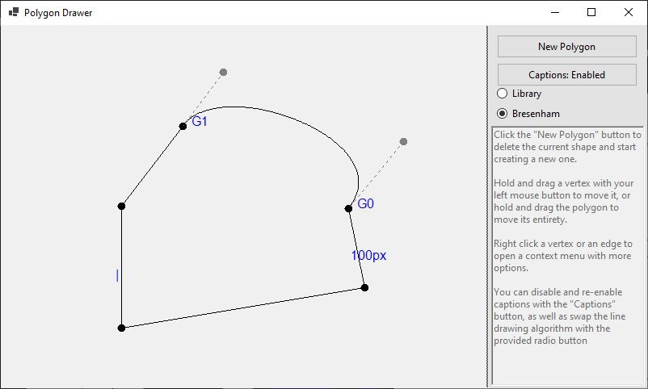
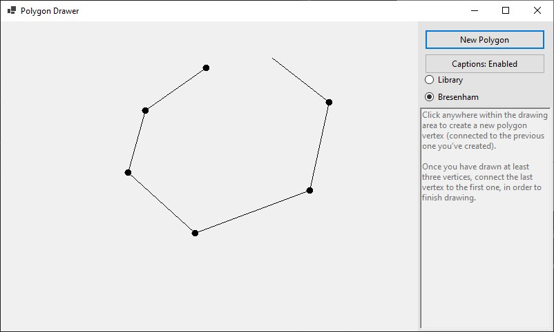
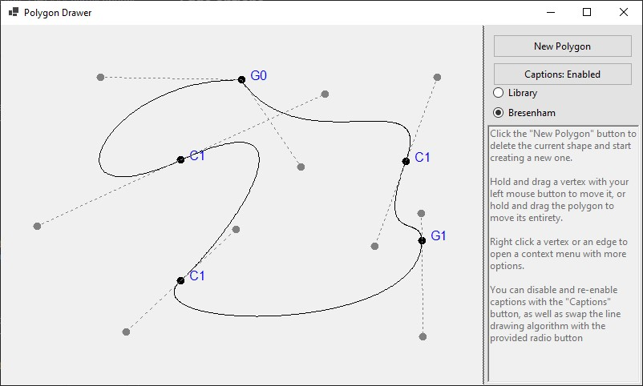

# Polygon Drawer

## Introduction

The project is an interactive polygon editor written using C#
and Windows Forms. It provides an abstract 2D-space polygon
model, with an UI providing the user with an
ability to draw and edit polygons. The user has an ability
to put constraints on specific edges, as well as replace them
with third degree Bézier curves, which includes an option for
setting continuities of their adjacent points.

## Installation and compilation

The project has been tested on a Windows 10 device, 
and compiled using .NET 8.0. Note that as a WinForms project, 
it isn't suited for being used on operational systems other 
than Windows.

If you want to compile the application on your device, install the program, by running `git clone` on this repository:
```shell
git clone https://github.com/kubapoke/polygon-drawer
```
Subsequently, run:
```shell
dotnet build <solution-file>
```
Where `<solution-file>` should be the path to the provided `PolygonDrawer.sln` file.
This requires having `dotnet` installed.

## Usage
Run the program by running
```shell
./PolygonDrawer
```
in the executable folder, or manually opening the 
```PolygonDrawer.exe``` file.

After running the application, you will be presented with an
example polygon.



Further in this section, all of the possibilities of the
application will be thoroughly explained. Please note however,
that the application contains built-in user instructions
(as seen on the right side of the above image) that should
be sufficient for explaining its full functionality.

### Polygon Creation
To create a new polygon (replacing the current one), click the
"New Polygon" button. This will remove the current polygon
and enter the polygon creation mode. While in it, press anywhere
within the application's main panel to draw a new polygon vertex.
The vertices need to be drawn in order of their appearance
on the polygon. To finish creation, after having drawn at least 3
vertices, click on the sarting vertex to close the polygon
and re-enter the edition mode.



### Entity movement
Click any vertex of the polygon or a control point of a
Bézier curve with the left mouse button and drag it to move the
chosen point. This shoudn't affect the position of
any other vertices, as long as it's not enforced by any
of the [edge](#edge-options) or [vertex](#vertex-options)
constraints.

If you click and drag anywhere else within the polygon's
bounding box, you will be able to move the entire polygon
freely.

### Edge options
When clicking on an edge with the right mouse button,
a context menu containing the following options
will become available:
* **Add point** - Adds a polygon vertex at the specified
point on the chosen edge. Both of the new edges adjacent
to the new point have any constraints removed.
* **Make vertical** - Sets the edge to be vertical and
forces it to remain so after polygon modifications.
Two adjacent edges can't both have this constraint.
* **Make horizontal** - Sets the edge to be horizontal and
forces it to remain so after polygon modifications.
Two adjacent edges can't both have this constraint.
* **Force length...** - Forces the length of the edge to be
constant, either its current length (**Current length** option)
or an user-inputted length (**Set length** option).
* **Create Bezier Curve** - Transforms the edge into a 3rd
degree Bézier curve. The edge appears with two movable
control points. Both of the edge's endpoints are set to be of
C1 continuity, unless they were already endpoints of another
Bézier curve with their continuities set.
* **Remove restrictions** - Transforms the edge into it's
original state with no constraints. 

Please note, that an edge can't have more than one constraint
at the same time.

### Vertex options
When clicking on a polygon vertex with the right mouse button,
a context menu containing the following options
will become available:
* **Delete point** - Removes the point, connecting its adjacent
edges and removing any constraints from them.

The following options will only be enabled if the vertex
is an endpoint of a Bézier curve:
* **Set G0 continuity** - Sets vertice's continuity to G0
(positional continuity)
* **Set G1 continuity** - Sets vertice's continuity to G1
(tangential continuity)
* **Set C1 continuity** - Sets vertice's continuity to C1
(derivative continuity)

### Key shortcuts
The application accepts te following keyboard shortcuts,
mostly for presentation purposes:
* ```ctrl + B``` - Transforms all of the polygon's edges
into Bézier curves with C1 continuity vertices between them
* ```ctrl + F``` - Forces all of the polygon's edges
to remain their current length.
* ```ctrl + R``` - Removes constraints from all edges.

The below picture presents what an example polygon 
with all of its edges turned into Bézier curves looks
like:


### Additional settings
Click the "Captions" button to disable or re-enable the captions
next to the constrained edges and vertices with set continuity.

Additionally, can use the provided radio button to swap
the line drawing algorithm between a built-in library one,
and a self-written Bresenham algorithm implementation.
This however shouldn't actually impact appearance of the 
polygon.